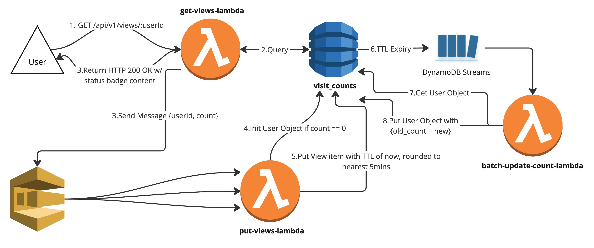
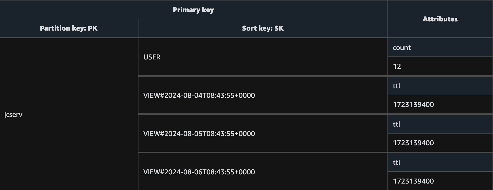
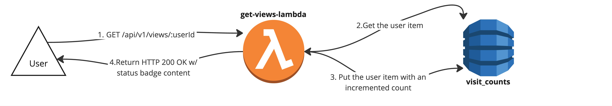

# vu-mi

vu-mi is a public API to enable view count badges in Markdown. 
The API returns up-to-date counts, up to {prevComputedCount} + 249. Any more than that, and it will show a stale count.


It is tremendously over-engineered, using the following technologies:
- AWS Lambda
- DynamoDB
- DynamoDB Streams
- SQS

I implemented it to implement concepts I've learned about, but never worked with such as:
- Modelling one-to-many relationships in a DynamoDB single table design (from [The DynamoDB Book](https://dynamodbbook.com/), by Alex Debrie)
- Change Data Capture

## Usage

To use this in a Markdown document, simply paste the following, and insert your unique ID:
```md

```

The ID could be your Github username, Github repo, anything you want really.

## API

### GET /v1/api/views?id=YOUR-ID-HERE
Response:
```
200 OK
{
    "schemaVersion": 1,
    "label": "views",
    "message": "12",
    "color": "blue"
}
```

## Design

### End-to-End Flow



`<get-views-lambda>`
1. `GET /v1/api/views?id=jcserv` request comes into `get-views-lambda`
2. `get-views-lambda` queries Dynamo for all items with matching PK, limit of 250
3.  a. Send SQS message with user id & count

    b. Return response with count - 1 (minus one to account for the USER item)

`<put-views-lambda>`

4. If the provided count is 0, PUT the USER item
> Q: Is there a risk of race conditions here when multiple requests come in for a new user?

A: Nope! At worst, there's repeated PUTs that are not necessary, but thanks to the way we've modelled it, there's no collisions.

5. Put VIEW item, with TTL rounded to the next 5 min interval

6. Items expire; DynamoDB streams sends records with each item

> This is essentially the same as having a 5-min cron job to collate View items, but without having to SCAN the entire table.

> Streams is also nice here since, rather than one invocation per item expiring, we can do a bulk update. Savings++

`<batch-update-count-lambda>`

7. Get the user object using the PK provided from the DynamoDB Streams record

8. Put the new count onto the user item

### Dynamo Model



## Discussion

> Q: Was this really necessary?

Not really, it could've been achieved with a simpler design, like so:



But that wouldn't be fun!

## Author's Note

This project is named after my cat Yumi, since I implemented the majority of this during an early morning
after she woke me up TT


